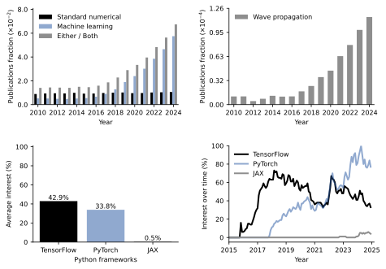
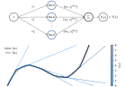
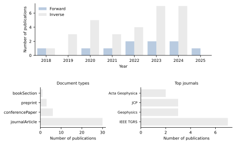
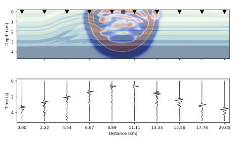
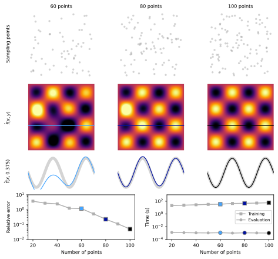

# A Scoping Review of Machine Learning Approaches for Wave Propagation Modeling in Seismology 

This repository contains the scripts used to generate the figures presented in the scoping review. It aims to promote reproducibility by providing the computational resources required to reproduce the reported analyses and visualizations. The repository structure follows the organization of the review, including illustrative examples, data processing workflows, and scripts for generating the figures and charts derived from the literature search.


## Installation

We recommend setting up a new Python environment with conda. You can do this by running the following commands:

```
conda env create -f ml-seismic-waves-env.yml
conda activate ml-seismic-waves-env
```

### Install PyTorch with CUDA support

After activating the environment, install PyTorch, TorchVision, and TorchAudio with CUDA 12.8 support (adjust if your nvidia-smi shows a different CUDA version): 

 ```
pip install torch torchvision torchaudio --index-url https://download.pytorch.org/whl/cu128
 ```

Make sure your system’s NVIDIA driver and CUDA toolkit are properly installed.
You can check your CUDA version with:

 ```
nvidia-smi
 ```

Example output: 

 ```
CUDA Version: 12.8
 ```

To confirm that PyTorch detects your GPU and CUDA correctly, run:

 ```
python -c "import torch; print(torch.__version__, torch.version.cuda, torch.cuda.is_available(), torch.cuda.get_device_name(0))"
 ```

Example output:

 ```
2.8.0+cu128 12.8 True NVIDIA RTX 2000 Ada Generation Laptop GPU
 ```

 2.8.0+cu128   →  PyTorch version 2.8.0 compiled with CUDA 12.8

12.8          →  CUDA runtime version recognized by PyTorch

True          →  GPU is available and correctly detected

NVIDIA RTX 2000 Ada Generation Laptop GPU  →  Your GPU model

To verify the packages installed in your `ml-seismic-waves-env-env` conda environment, you can use the following command:

 ```
conda list -n ml-seismic-waves-env
 ```

# Repository Organisation

`main/`:

- `01_finite_difference_Helmholtz2D/`: Ilustrative example of standard methods sampling.


- `02_publication_trends_ml_wave_frameworks/`: Plots of the current trends of the field of study in the review.



- `03_universal_approximation_demo/`: Ilustrative example of the Universal Approximation Theorem.



- `04_data_charting/`: Charting data obtained from the review search.



- `05_seismic_inverse/`: Ilustrative example of seismic inversion.



- `06_PINNs_Helmholz2D/`: Ilustrative example of PINNs sampling.

