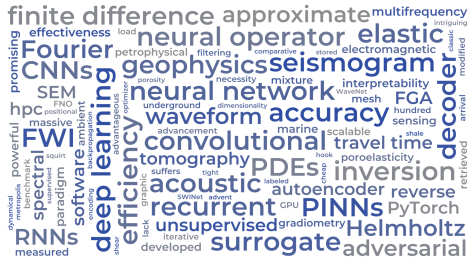

# Data charting

This section contains the scripts used to generate the figures presented in the scoping review. 
The provided code was developed to process and visualize the metadata and annotations collected during the review process.

The metadata corresponds to the publications identified during the literature search and includes information such as:
- document type,
- publication year,
- title,
- publication source/journal,
- and other bibliographic information.

In addition, the dataset includes annotations extracted during the manual reading and screening of the selected publications. These annotations were used for the qualitative analysis and categorization presented in the review.

The repository also includes the code used to generate the word cloud analysis. However, the full-text documents of the publications are not provided due to copyright restrictions. The word cloud figure presented in the paper was generated using the full-text content of the selected publications. To demonstrate the use of the provided code, examples based on publicly available metadata fields (such as abstracts and keywords) are included instead.

The scripts are intended to ensure transparency and reproducibility of the data analysis workflow, allowing users to reproduce the figures using the provided metadata and example text inputs.

